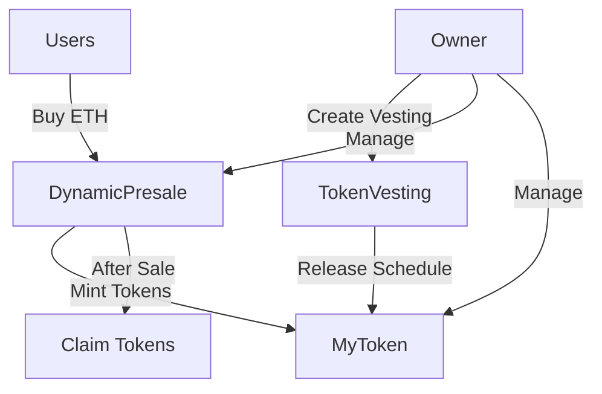

# 🚀 Dynamic Token Presale System

Un sistema completo de presale de tokens con múltiples fases, precios dinámicos y funcionalidades de vesting para equipo y asesores.

## 📋 Características Principales

### 🪙 MyToken (ERC20)
- **Token estándar ERC20** con funcionalidades avanzadas
- **Control de acceso por roles** (MINTER, PAUSER, BURNER)
- **Suministro máximo limitado** (capped supply)
- **Funcionalidad de pausa** para emergencias
- **Burn capabilities** para deflación controlada

### 🎯 DynamicPresale
- **Múltiples fases** con precios diferentes
- **Soft cap configurable** para validar éxito de la presale
- **Límites por wallet** para distribución equitativa
- **Sistema de reembolso** si no se alcanza el soft cap
- **Protección contra reentrancy** y otros ataques
- **Pausable** para control administrativo

### 🔐 TokenVesting
- **Vesting lineal** con períodos de cliff
- **Múltiples schedules** por beneficiario
- **Revocable** para miembros del equipo
- **No revocable** para asesores
- **Liberación gradual** de tokens

## 🏗️ Arquitectura del Sistema



## 📦 Instalación y Configuración

### Prerrequisitos
- Node.js >= 16
- npm o yarn
- Git

### Instalación
```bash
# Clonar repositorio
git clone <repository-url>
cd dynamic-presale

# Instalar dependencias
cd packages/contracts
npm install

# Copiar variables de entorno
cp .env.example .env
# Editar .env con tus configuraciones
```

### Variables de Entorno
```env
# Deployment
DEPLOYER_PRIVATE_KEY=your_private_key_here
SEPOLIA_RPC=https://sepolia.infura.io/v3/your_key_here
MAINNET_RPC=https://mainnet.infura.io/v3/your_key_here

# Verification
ETHERSCAN_API_KEY=your_etherscan_api_key_here

# Contract Addresses (after deployment)
MYTOKEN_ADDRESS=
DYNAMICPRESALE_ADDRESS=
TOKENVESTING_ADDRESS=

# Optional
REPORT_GAS=true
COINMARKETCAP_API_KEY=your_cmc_api_key_here
```

## 🚀 Deployment

### Red Local (Hardhat)
```bash
# Iniciar nodo local
npx hardhat node

# Deploy en otra terminal
npx hardhat deploy --network localhost

# Verificar deployment
npm run status
```

### Testnet (Sepolia)
```bash
# Deploy
npx hardhat deploy --network sepolia

# Verificar contratos
npx hardhat verify --network sepolia <contract_address> <constructor_args>
```

### Mainnet
```bash
# Deploy (¡CUIDADO!)
npx hardhat deploy --network mainnet

# Verificar contratos
npx hardhat verify --network mainnet <contract_address> <constructor_args>
```

## 🧪 Testing

### Ejecutar Tests
```bash
# Tests completos
npm test

# Tests específicos
npm test MyToken.test.ts
npm test DynamicPresale.test.ts
npm test TokenVesting.test.ts
npm test Integration.test.ts

# Coverage
npm run coverage

# Gas reporting
REPORT_GAS=true npm test
```

### Estructura de Tests
- **Unit Tests**: Funcionalidad individual de cada contrato
- **Integration Tests**: Flujos end-to-end completos
- **Edge Cases**: Scenarios de límite y error
- **Gas Optimization**: Verificación de costos de gas

## 🔧 Scripts de Gestión

### Estado General
```bash
# Ver estado completo del sistema
npm run status
```

### Gestión de Presale
```bash
# Pausar presale
npm run manage-presale pause

# Reanudar presale
npm run manage-presale unpause

# Terminar sale manualmente
npm run manage-presale end

# Retirar ganancias
npm run manage-presale withdraw [recipient_address]

# Agregar nueva fase
npm run manage-presale add-phase <priceWei> <supply> <start> <duration>
```

### Gestión de Vesting
```bash
# Crear vesting personalizado
npm run manage-vesting create <beneficiary> <amount> <start> <duration> <cliff> <revocable>

# Crear vesting para equipo (1 año, 3 meses cliff)
npm run manage-vesting create-team <address> <amount>

# Crear vesting para asesor (6 meses, 1 mes cliff)
npm run manage-vesting create-advisor <address> <amount>

# Liberar tokens
npm run manage-vesting release [scheduleId]

# Revocar vesting
npm run manage-vesting revoke <beneficiary> [scheduleId]

# Ver estado de vesting
npm run manage-vesting status <beneficiary>
```

### Compra de Tokens (Testing)
```bash
# Comprar tokens (cantidad en ETH)
npm run buy-tokens [amount]

# Ejemplo: comprar con 1 ETH
npm run buy-tokens 1.0
```

## 📊 Parámetros de Configuración

### Token Parameters
- **Name**: Dynamic Presale Token
- **Symbol**: DPT
- **Decimals**: 18
- **Max Supply**: 100,000,000 tokens

### Presale Parameters
- **Soft Cap**: 10 ETH
- **Min Buy**: 0.01 ETH
- **Max Per Wallet**: 20 ETH

### Phase Configuration
- **Phase 0**: 0.0005 ETH/token (Early Bird)
- **Phase 1**: 0.001 ETH/token (Regular)
- **Phase 2**: 0.002 ETH/token (Final)
- **Supply per Phase**: 100,000 tokens

## 🔒 Seguridad

### Auditorías Implementadas
- ✅ **ReentrancyGuard**: Protección contra ataques de reentrancy
- ✅ **Pausable**: Capacidad de pausa para emergencias
- ✅ **AccessControl**: Control granular de permisos
- ✅ **PullPayment**: Patrón seguro para pagos
- ✅ **SafeERC20**: Transferencias seguras de tokens

### Best Practices
- ✅ OpenZeppelin contracts v5.4.0
- ✅ Solidity ^0.8.20 (overflow protection nativo)
- ✅ Comprehensive test coverage
- ✅ Gas optimization
- ✅ Event logging completo

## 📈 Flujo de Usuario

### Para Compradores
1. **Fase Activa**: Verificar que hay una fase activa
2. **Comprar**: Enviar ETH al contrato durante fase activa
3. **Esperar**: Sale debe terminar y alcanzar soft cap
4. **Reclamar**: Reclamar tokens después del sale exitoso
5. **Refund**: Si no se alcanza soft cap, solicitar reembolso

### Para Administradores
1. **Deploy**: Desplegar contratos con parámetros correctos
2. **Setup**: Configurar fases, roles y permisos
3. **Monitor**: Usar scripts de estado para monitorear
4. **Manage**: Pausar/reanudar según necesidad
5. **Finalize**: Terminar sale y gestionar ganancias
6. **Vesting**: Crear schedules para equipo/asesores

## 🐛 Troubleshooting

### Errores Comunes

**"No active phase"**
```bash
# Verificar fases configuradas
npm run status
# Las fases deben tener timestamps correctos
```

**"Above max per wallet"**
```bash
# Verificar límite de compra
npm run status
# Usuario ha alcanzado límite máximo por wallet
```

**"Insufficient phase supply"**
```bash
# Fase actual agotada
npm run status
# Esperar siguiente fase o agregar nueva
```

**"Sale not ended"**
```bash
# Intentando reclamar antes de que termine
npm run manage-presale end
```

### Logs y Debugging
```bash
# Ver logs detallados
npx hardhat test --verbose

# Debug transacciones
npx hardhat run scripts/debug-tx.ts --network <network>
```

## 📚 Documentación Adicional

- [Whitepaper](docs/whitepaper.md)
- [API Reference](docs/api.md)
- [Security Audit](docs/security-audit.md)
- [Gas Analysis](docs/gas-analysis.md)

## 🤝 Contribución

1. Fork el proyecto
2. Crear branch de feature (`git checkout -b feature/amazing-feature`)
3. Commit cambios (`git commit -m 'Add amazing feature'`)
4. Push al branch (`git push origin feature/amazing-feature`)
5. Abrir Pull Request

## 📄 Licencia

Este proyecto está licenciado bajo MIT License - ver [LICENSE](LICENSE) para detalles.

## 🆘 Soporte

- **Issues**: [GitHub Issues](https://github.com/your-repo/issues)
- **Discussions**: [GitHub Discussions](https://github.com/your-repo/discussions)
- **Email**: support@yourproject.com

---

## 🚨 Disclaimer

Este código es para propósitos educativos y de desarrollo. Realizar auditoría de seguridad completa antes de usar en producción con fondos reales.

**⚠️ IMPORTANTE**: Siempre probar en testnets antes de deployment en mainnet.